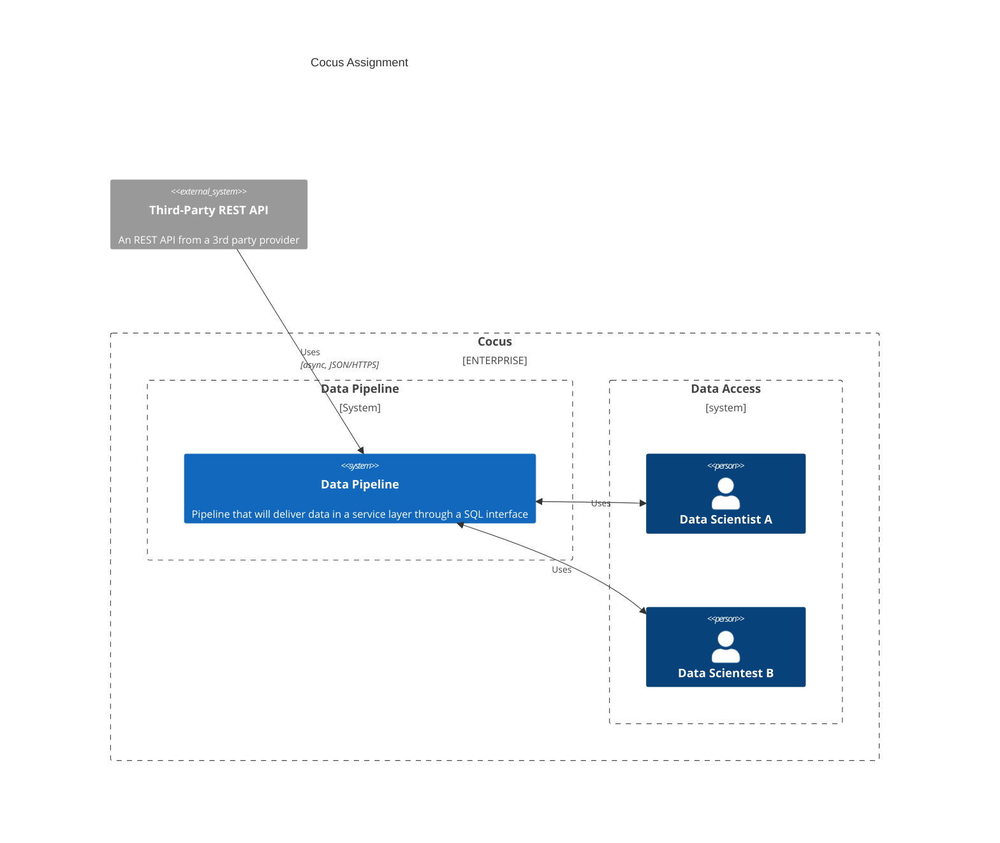
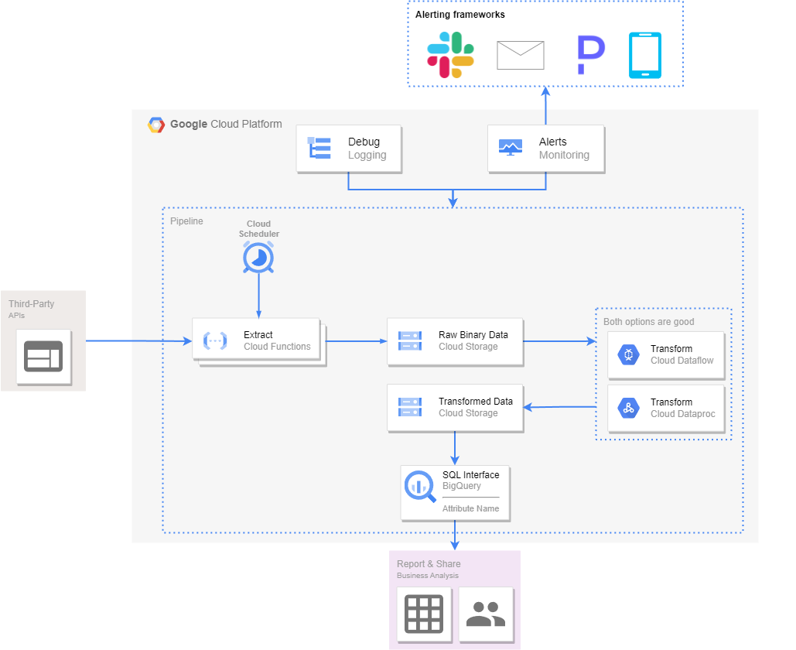

# Technical Description

## The Problem

The requirement is to design a data pipeline architecture which will enable the ingestion of data from a third-party tool and dumping it on a data lake (Blob Storage or equivalent). The third party tool exposes an HTTP endpoint, reachable only with a GET method.

1. The data must be stored in raw format.
2. A transforming layer must convert the data to a binary format (compressed).
3. A serving layer through a SQL interface must be offered to the data scientists, so they can interact with the transformed data in the bucket.

**Requirements:**

- Error-handling
- Retry mechanism
- Monitoring
- Scaling horizontally
- Data is stored into Blob Storage or equivalent to be serviced to the data scientists

## Summary

This document describes the proposed solution for the problem described above. The solution will be presented based on Google Cloud Platform (GCP) services as is the cloud provider i've been working with for the last 2 years and never worked with Azure. I will provide the Azure and AWS equivalent services across the document whenever possible.

Below a representation of of the workflow that will be implemented.

We will focus on the `Data Pipeline` part of the diagram.

## Implementation Overview

Before start, I will refers the Aws and Azure equivalent services for each GCP service used in the solution.

| GCP Service | AWS Service | Azure Service |
| ----------- | ----------- | ------------- |
| Cloud Scheduler | CloudWatch Events | Azure Scheduler |
| Cloud Functions | Lambda | Azure Functions |
| Cloud Storage | S3 | Azure Blob Storage |
| Cloud Dataflow | Amazon Kinesis |Azure Stream Analytics |
| Cloud Dataproc | Amazon EMR, AWS Glue | Azure Data Lake Analytics, HDInsight |
| BigQuery | Amazon Redshift | Azure Synapse Analytics |
| Cloud Logging | CloudWatch Logs | Azure Monitor Logs |
| Cloud Monitoring | CloudWatch | Azure Monitor |
| Cloud Run | AWS App Runner, AWS Fargate, AWS Lambda | Azure Container Apps, Azure Container Instances |
| Google Kubernetes Engine | Amazon EKS | Azure Kubernetes Service |

### Ingestion

I would implement a **Cloud Function** (or several, depending on the third-party API) that will be triggered by a **Cloud Scheduler**. The Cloud Function will be responsible for making the HTTP request to the third-party API and store the response in a **Cloud Storage** bucket.

   1. In my opinion, one cloud function per endpoint is the best approach. Allow us to scale each endpoint independently, have a better error handling and monitoring and a better code organization. More less a microservice approach.
      1. Having so many functions might lead to an idea of uncontrollable costs. But, the price model of cloud function aren't based on the number of functions but on the number of invocations and the amount of resources used. So, having 1 function or 1000 functions doesn't make any difference in terms of costs if the compute time and network usage are the same.
   2. Cloud Functions can be scalled horizontally, up to 100 instances, independently the machine resources.
      1. Instead having multiple functions, we could have a function per third-party API with many endpoints withing it. The scaling would be trickier because would be necessary more complex logic to handle the scaling of each endpoint.

It is important to develop **idempotent** code, so we can retry the execution in case of failure. The retry mechanism can be implemented in the Cloud Scheduler or in the Cloud Function itself. I would prefer to implement it in the Cloud Function, so we can have more control over the retry logic.

### Storage

Using **Google Cloud Platform**, BigQuery can't query Binary files, only the most commom formats like CSV, JSON, AVRO, etc. That's why I opted by storing raw binary files in a **Cloud Storage** bucket, we will need to decompress the files before querying them.

### Transformation

The transformation layer could be implemented in several ways. I will describe 2 options that are suitable for this use case. Most of the times is a question of expertise within the team and the cost of the solution. If your team is more familiar with a specific technology and the budget is not a problem, doesn't make sense go with a cheaper solution that will take more time to implement and maintain.

   1. Cloud Dataflow: It's a fully managed service for executing Apache Beam pipelines within the Google Cloud Platform ecosystem. Apache Beam is a unified programming model that allows us to implement batch and streaming data processing jobs that can run on any execution engine.
   2. Cloud Dataproc: It's a fully managed service for running Apache Spark and Apache Hadoop clusters in a simpler, more cost-efficient way. Apache Spark is a unified analytics engine for large-scale data processing. It can run on Hadoop, Apache Mesos, Kubernetes, standalone, or in the cloud.

### Serving Layer

Due to limitation I mention earlier, we will need to decompress the files before querying them. The decompression will be make on the transformation layer. The last layer (some call bronze, silver and gold) of the transformation should be a **Cloud Storage** bucket with the transformed data in a format that can be queried by BigQuery.

With BigQuery you can query data directly from Cloud Storage. One option could also be create some SQL views on top of the transformed data to make it easier to query. This way you would have a SQL layer to be used by any reporting tool, like Looker, Tableau, etc.

### Logging and Monitoring

The monitoring and logging will be done using Cloud Monitoring and Cloud Logging. Cloud Monitoring is a service that collects metrics, events, and metadata from Google Cloud. Cloud Logging is a fully managed service that performs at scale and can ingest application and system log data from thousands of VMs and services.

With **Cloud Logging** we can easily search and filter the logs of all the services involved in the solution.

With **Cloud Monitoring** we can create dashboards and alerts based on the metrics collected from the services involved in the solution. We can trigger alerts to notify us when something goes wrong or when some metric reach a specific threshold. You can set up notifications to be sent to email, Slack, PagerDuty, etc.

## Final Considerations

The solution described above is just one of the many possible solutions. The solution presented above tried to match with your requirements (ingestion, transformation and serving layer).

There are two scenarios where I can see this solution or being a overkill or struggle to keep up with the data volume.

### Low Data Volume

When the data volume is low, and from my experience, unless you want to extract events data from the third-party API, the data volume won't be that big that requires to have an Apache Beam pipeline or an Apache Spark cluster running.

In most of the cases, you could simply apply the transformations using the **Cloud Function** you developed to ingest data.

### High Data Volume

When the data volume is high, the solution described above might struggle to keep up with the data volume. It might be hard to develop code that can easily horizontally scale to handle the data volume. For example, if you are extraction data hourly, and you want to use deploy 3 instances of the cloud function, you will need to make sure that the data extract isn't overlapping between the instances.	That might be tricky to implement.

For this cases, in my opinion, and if the third-party API allows, is to use **WebHooks**. With WebHooks, the third-party API will send the data to your endpoint, instead of you making the request to the third-party API.

You can implement a Webhook in several ways. Spin a container in Google Kubernetes Engine (GKE), use Cloud Run and/or Cloud Functions, etc. Basically you will have and endpoint 24/7 waiting for the third-party API to send the data.

This way you can easily scale your solution horizontally, without worrying about overlapping data. For example, if you deploy your webhook as a Cloud Function, Google will handle the load balancing for you. If you deploy as a container in GKE, you might need some knowledge about Kubernetes to handle the load balancing.
